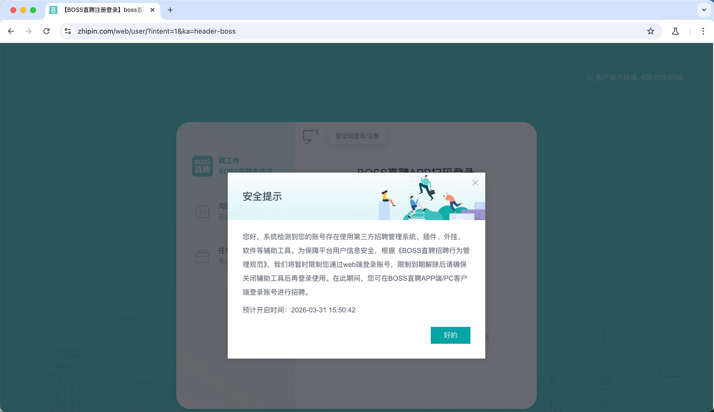

# Boss直聘自动化招聘系统

> ## ⚠️ 严重警告：会被封号！
>
> **Boss直聘已能检测Playwright等自动化工具，使用本项目会导致Web端账号被临时封禁。**
>
> 
>
> 封禁期间无法通过Web端登录，仅能使用APP或PC客户端。**请勿将本代码用于实际生产环境，仅作学习研究参考。**

## 功能

- Playwright浏览器自动化
- 多岗位并行筛选（最多5个岗位同时运行）
- 规则硬筛选 + LLM语义评分
- 自动发送标准问题/婉拒消息
- Streamlit Web界面可视化管理

## 技术栈

- Python 3.12 + Playwright
- Streamlit Web UI
- Anthropic兼容LLM接口（MiniMax等）
- APScheduler定时任务

## 项目结构

```
boss-auto/
├── config/          # 配置文件
├── src/             # 核心代码
│   ├── crawler.py   # Playwright爬虫
│   ├── runner.py    # 后台任务管理器（多岗位并行）
│   ├── resume_filter.py  # 规则+LLM双重筛选
│   ├── messenger.py # 消息发送
│   ├── llm_client.py     # LLM客户端
│   └── main.py      # 命令行入口
├── web.py           # Streamlit Web界面
├── docs/            # 文档和截图
└── start.sh         # 启动脚本
```
